# TR2000 Pipe Size Specifications Demo Architecture

*Vivek P - 6th August 2025*

## Database Entity Relationship Diagram

```mermaid
%%{init: {'theme':'base', 'themeVariables': { 'primaryColor': '#7b1fa2', 'primaryTextColor': '#000000', 'primaryBorderColor': '#7b1fa2', 'lineColor': '#666666', 'secondaryColor': '#f57c00', 'tertiaryColor': '#2e7d32', 'background': '#ffffff', 'mainBkg': '#ffffff', 'secondBkg': '#f7f7f7', 'tertiaryBkg': '#efefef'}}}%%
erDiagram
    PLANT {
        int PlantID PK "🔑 PRIMARY KEY"
        string LongDescription "Full plant name"
        string ShortDescription "Plant abbreviation"
    }
    
    PCS {
        string PCS PK "🔑 PRIMARY KEY"
        string Revision PK "🔑 PRIMARY KEY"
        int PlantID FK "🔗 REFERENCES Plant.PlantID"
        string Status "Current status"
        string RevDate "Revision date"
        string DimElementChange "Change indicator"
    }
    
    PIPE_SIZE {
        string NomSize PK "🔑 PRIMARY KEY"
        string PCS PK "🔑 PRIMARY KEY"
        string Revision PK "🔑 PRIMARY KEY"
        int PlantID FK "🔗 REFERENCES Plant.PlantID"
        string OuterDiam "Diameter in mm"
        string WallThickness "Thickness in mm"
        string Schedule "Pipe schedule"
        string UnderTolerance "Tolerance percentage"
        string CorrosionAllowance "Corrosion allowance"
        string WeldingFactor "Welding factor"
        string DimElementChange "Change indicator"
        string ScheduleInMatrix "Y/N matrix inclusion"
    }
    
    %% Relationships with clear reference descriptions
    PLANT ||--o{ PCS : "🔗 PlantID-to-PlantID"
    PCS ||--o{ PIPE_SIZE : "🔗 PCS-and-Revision-to-PCS-and-Revision"
    PLANT ||--o{ PIPE_SIZE : "🔗 PlantID-to-PlantID"
```

## API Endpoint Structure Diagram

## Data Flow and Relationships

## Detailed Pipe Size Entity Structure

## API Response Structure

## Application Architecture Flow

## Key Insights from Implementation

### 1. **Hierarchical Structure**: 
- Plant → PCS → Revision → Pipe Sizes
- Each level depends on the previous selection

### 2. **Data Relationships**:
- Plants have multiple PCS systems
- Each PCS can have multiple revisions
- Each revision contains specific pipe size specifications
- Pipe sizes are uniquely identified by Plant+PCS+Revision+NomSize

### 3. **Comparison Logic**:
- Two different revisions of the same PCS can be compared
- Comparison shows: Base Revision → Current Revision
- Null values are properly handled and displayed as "Null"

### 4. **API Response Pattern**:
- All endpoints return similar response structure with Success flag
- Data is contained in specific properties (GetPlant, GetPCS, GetPipeSize)
- Error handling is consistent across all endpoints

This ERD reflects the actual working implementation and API structure discovered during the proof-of-concept development.