# TR2000 PipeSpec API - Complete Entity Relationship Diagram

*Comprehensive ERD covering all endpoints and data structures*

## Master Entity Relationship Diagram

```mermaid
%%{init: {'theme':'base', 'themeVariables': { 'primaryColor': '#7b1fa2', 'primaryTextColor': '#000000', 'primaryBorderColor': '#7b1fa2', 'lineColor': '#333333', 'secondaryColor': '#f57c00', 'tertiaryColor': '#2e7d32', 'background': '#ffffff', 'mainBkg': '#ffffff', 'clusterTextColor': '#ffffff', 'titleColor': '#ffffff', 'edgeLabelBackground': '#ffffff', 'attributeFill': '#ffffff', 'attributeColor': '#000000'}}}%%
erDiagram
    %% Core Organizational Structure
    OPERATOR {
        int OperatorID PK "🔑 PRIMARY KEY"
        string OperatorName "Operator company name"
        string Description "Operator description"
        string ContactInfo "Contact details"
    }
    
    PLANT {
        int PlantID PK "🔑 PRIMARY KEY"
        int OperatorID FK "🔗 REFERENCES Operator.OperatorID"
        string LongDescription "Full plant name"
        string ShortDescription "Plant abbreviation"
        string Location "Plant location"
        string Status "Operational status"
    }
    
    %% Issue Management System
    ISSUE {
        string IssueID PK "🔑 PRIMARY KEY"
        int PlantID FK "🔗 REFERENCES Plant.PlantID"
        string IssueType "Type of issue"
        string Status "Current status"
        string Description "Issue description"
        datetime CreatedDate "Creation timestamp"
    }
    
    ISSUE_REVISION {
        string IssueID PK "🔑 PRIMARY KEY"
        string RevisionID PK "🔑 PRIMARY KEY"
        datetime RevisionDate "Revision timestamp"
        string Status "Revision status"
        string Notes "Revision notes"
    }
    
    %% PCS (Pipe Class System) Structure
    PCS {
        string PCS PK "🔑 PRIMARY KEY"
        string Revision PK "🔑 PRIMARY KEY"
        int PlantID FK "🔗 REFERENCES Plant.PlantID"
        string IssueID FK "🔗 REFERENCES Issue.IssueID"
        string Status "Current status"
        string RevDate "Revision date"
        string Description "PCS description"
    }
    
    PCS_HEADER {
        string PCS PK "🔑 PRIMARY KEY"
        string Revision PK "🔑 PRIMARY KEY"
        string HeaderType "Header classification"
        string Properties "Header properties JSON"
        string Standards "Applicable standards"
        string Notes "Additional notes"
    }
    
    PCS_TEMPERATURE_PRESSURE {
        string PCS PK "🔑 PRIMARY KEY"
        string Revision PK "🔑 PRIMARY KEY"
        string ConditionID PK "🔑 PRIMARY KEY"
        decimal Temperature "Operating temperature"
        decimal Pressure "Operating pressure"
        string Units "Temperature/Pressure units"
        string Description "Condition description"
    }
    
    PIPE_SIZE {
        string NomSize PK "🔑 PRIMARY KEY"
        string PCS PK "🔑 PRIMARY KEY"
        string Revision PK "🔑 PRIMARY KEY"
        int PlantID FK "🔗 REFERENCES Plant.PlantID"
        string OuterDiam "Diameter in mm"
        string WallThickness "Thickness in mm"
        string Schedule "Pipe schedule"
        string UnderTolerance "Tolerance percentage"
        string CorrosionAllowance "Corrosion allowance"
        string WeldingFactor "Welding factor"
        string ScheduleInMatrix "Y/N matrix inclusion"
    }
    
    PIPE_ELEMENT {
        string ElementID PK "🔑 PRIMARY KEY"
        string PCS PK "🔑 PRIMARY KEY"
        string Revision PK "🔑 PRIMARY KEY"
        string ElementType "Type of pipe element"
        string Specification "Element specification"
        string Material "Element material"
        string Rating "Pressure rating"
        string Standards "Applicable standards"
    }
    
    VALVE_ELEMENT {
        string ValveID PK "🔑 PRIMARY KEY"
        string PCS PK "🔑 PRIMARY KEY"
        string Revision PK "🔑 PRIMARY KEY"
        string ValveType "Type of valve"
        string Specification "Valve specification"
        string Material "Valve material"
        string Rating "Pressure rating"
        string Actuation "Valve actuation method"
        string Standards "Applicable standards"
    }
    
    EMBEDDED_NOTE {
        string NoteID PK "🔑 PRIMARY KEY"
        string PCS PK "🔑 PRIMARY KEY"
        string Revision PK "🔑 PRIMARY KEY"
        string NoteType "Type of note"
        string Content "Note content"
        string Position "Note position reference"
        datetime CreatedDate "Note creation date"
    }
    
    %% VDS (Valve Data Sheet) Structure
    VDS {
        string VDSID PK "🔑 PRIMARY KEY"
        string Revision PK "🔑 PRIMARY KEY"
        int PlantID FK "🔗 REFERENCES Plant.PlantID"
        string IssueID FK "🔗 REFERENCES Issue.IssueID"
        string Description "VDS description"
        string Status "Current status"
        string RevDate "Revision date"
    }
    
    VDS_SUBSEGMENT {
        string SubsegmentID PK "🔑 PRIMARY KEY"
        string VDSID PK "🔑 PRIMARY KEY"
        string Revision PK "🔑 PRIMARY KEY"
        string SubsegmentType "Type of subsegment"
        string Properties "Subsegment properties JSON"
        string Description "Subsegment description"
        int SortOrder "Display order"
    }
    
    %% Reference Tables for Various Standards
    PCS_REFERENCE {
        string ReferenceID PK "🔑 PRIMARY KEY"
        string PCS FK "🔗 REFERENCES PCS.PCS"
        string ReferenceType "Type of reference"
        string ReferenceCode "Reference code"
        string Description "Reference description"
        string Standard "Applicable standard"
    }
    
    SC_REFERENCE {
        string SCID PK "🔑 PRIMARY KEY"
        string IssueID FK "🔗 REFERENCES Issue.IssueID"
        string Description "SC description"
        string Standard "Applicable standard"
        string Status "Reference status"
    }
    
    VSM_REFERENCE {
        string VSMID PK "🔑 PRIMARY KEY"
        string IssueID FK "🔗 REFERENCES Issue.IssueID"
        string Description "VSM description"
        string Standard "Applicable standard"
        string Status "Reference status"
    }
    
    VSK_REFERENCE {
        string VSKID PK "🔑 PRIMARY KEY"
        string IssueID FK "🔗 REFERENCES Issue.IssueID"
        string Description "VSK description"
        string Standard "Applicable standard"
        string Status "Reference status"
    }
    
    EDS_REFERENCE {
        string EDSID PK "🔑 PRIMARY KEY"
        string IssueID FK "🔗 REFERENCES Issue.IssueID"
        string Description "EDS description"
        string Standard "Applicable standard"
        string Status "Reference status"
    }
    
    MDS_REFERENCE {
        string MDSID PK "🔑 PRIMARY KEY"
        string IssueID FK "🔗 REFERENCES Issue.IssueID"
        string Description "MDS description"
        string Standard "Applicable standard"
        string Status "Reference status"
    }
    
    ESK_REFERENCE {
        string ESKID PK "🔑 PRIMARY KEY"
        string IssueID FK "🔗 REFERENCES Issue.IssueID"
        string Description "ESK description"
        string Standard "Applicable standard"
        string Status "Reference status"
    }
    
    %% Bolt Tension System
    FLANGE_TYPE {
        string FlangeTypeID PK "🔑 PRIMARY KEY"
        int PlantID FK "🔗 REFERENCES Plant.PlantID"
        string FlangeClass "Flange classification"
        string Rating "Pressure rating"
        string Standard "Applicable standard"
        string Material "Flange material"
        string Description "Flange description"
    }
    
    GASKET_TYPE {
        string GasketTypeID PK "🔑 PRIMARY KEY"
        int PlantID FK "🔗 REFERENCES Plant.PlantID"
        string GasketMaterial "Gasket material"
        string GasketType "Type of gasket"
        string Standard "Applicable standard"
        string Description "Gasket description"
        decimal Thickness "Gasket thickness"
    }
    
    BOLT_MATERIAL {
        string BoltMaterialID PK "🔑 PRIMARY KEY"
        int PlantID FK "🔗 REFERENCES Plant.PlantID"
        string Material "Bolt material"
        string Grade "Material grade"
        string Standard "Applicable standard"
        decimal TensileStrength "Tensile strength"
        decimal YieldStrength "Yield strength"
    }
    
    TENSION_FORCES {
        string TensionID PK "🔑 PRIMARY KEY"
        string FlangeTypeID FK "🔗 REFERENCES FlangeType.FlangeTypeID"
        string GasketTypeID FK "🔗 REFERENCES GasketType.GasketTypeID"
        string BoltMaterialID FK "🔗 REFERENCES BoltMaterial.BoltMaterialID"
        decimal RequiredTension "Required tension force"
        decimal MaxTension "Maximum tension force"
        decimal MinTension "Minimum tension force"
        string Units "Force units"
    }
    
    TENSION_TOOL {
        string ToolID PK "🔑 PRIMARY KEY"
        int PlantID FK "🔗 REFERENCES Plant.PlantID"
        string ToolType "Type of tensioning tool"
        string Manufacturer "Tool manufacturer"
        string Model "Tool model"
        decimal MaxCapacity "Maximum tool capacity"
        string Calibration "Calibration status"
    }
    
    TOOL_PRESSURE {
        string PressureID PK "🔑 PRIMARY KEY"
        string ToolID FK "🔗 REFERENCES TensionTool.ToolID"
        string TensionID FK "🔗 REFERENCES TensionForces.TensionID"
        decimal RequiredPressure "Required hydraulic pressure"
        string Units "Pressure units"
        decimal Tolerance "Pressure tolerance"
    }
    
    LUBRICANT {
        string LubricantID PK "🔑 PRIMARY KEY"
        int PlantID FK "🔗 REFERENCES Plant.PlantID"
        string LubricantType "Type of lubricant"
        string Brand "Lubricant brand"
        string Specification "Lubricant specification"
        decimal FrictionCoefficient "Friction coefficient"
        string ApplicationMethod "Application method"
    }
    
    %% Core Relationships
    OPERATOR ||--o{ PLANT : "🔗 OperatorID-to-OperatorID"
    PLANT ||--o{ ISSUE : "🔗 PlantID-to-PlantID"
    ISSUE ||--o{ ISSUE_REVISION : "🔗 IssueID-to-IssueID"
    PLANT ||--o{ PCS : "🔗 PlantID-to-PlantID"
    ISSUE ||--o{ PCS : "🔗 IssueID-to-IssueID"
    PCS ||--o{ PCS_HEADER : "🔗 PCS+Revision-to-PCS+Revision"
    PCS ||--o{ PCS_TEMPERATURE_PRESSURE : "🔗 PCS+Revision-to-PCS+Revision"
    PCS ||--o{ PIPE_SIZE : "🔗 PCS+Revision-to-PCS+Revision"
    PCS ||--o{ PIPE_ELEMENT : "🔗 PCS+Revision-to-PCS+Revision"
    PCS ||--o{ VALVE_ELEMENT : "🔗 PCS+Revision-to-PCS+Revision"
    PCS ||--o{ EMBEDDED_NOTE : "🔗 PCS+Revision-to-PCS+Revision"
    PCS ||--o{ PCS_REFERENCE : "🔗 PCS-to-PCS"
    
    %% VDS Relationships
    PLANT ||--o{ VDS : "🔗 PlantID-to-PlantID"
    ISSUE ||--o{ VDS : "🔗 IssueID-to-IssueID"
    VDS ||--o{ VDS_SUBSEGMENT : "🔗 VDSID+Revision-to-VDSID+Revision"
    
    %% Reference Relationships
    ISSUE ||--o{ SC_REFERENCE : "🔗 IssueID-to-IssueID"
    ISSUE ||--o{ VSM_REFERENCE : "🔗 IssueID-to-IssueID"
    ISSUE ||--o{ VSK_REFERENCE : "🔗 IssueID-to-IssueID"
    ISSUE ||--o{ EDS_REFERENCE : "🔗 IssueID-to-IssueID"
    ISSUE ||--o{ MDS_REFERENCE : "🔗 IssueID-to-IssueID"
    ISSUE ||--o{ ESK_REFERENCE : "🔗 IssueID-to-IssueID"
    
    %% Bolt Tension Relationships
    PLANT ||--o{ FLANGE_TYPE : "🔗 PlantID-to-PlantID"
    PLANT ||--o{ GASKET_TYPE : "🔗 PlantID-to-PlantID"
    PLANT ||--o{ BOLT_MATERIAL : "🔗 PlantID-to-PlantID"
    PLANT ||--o{ TENSION_TOOL : "🔗 PlantID-to-PlantID"
    PLANT ||--o{ LUBRICANT : "🔗 PlantID-to-PlantID"
    FLANGE_TYPE ||--o{ TENSION_FORCES : "🔗 FlangeTypeID-to-FlangeTypeID"
    GASKET_TYPE ||--o{ TENSION_FORCES : "🔗 GasketTypeID-to-GasketTypeID"
    BOLT_MATERIAL ||--o{ TENSION_FORCES : "🔗 BoltMaterialID-to-BoltMaterialID"
    TENSION_TOOL ||--o{ TOOL_PRESSURE : "🔗 ToolID-to-ToolID"
    TENSION_FORCES ||--o{ TOOL_PRESSURE : "🔗 TensionID-to-TensionID"
```



## Complete API Endpoint Structure


## Data Domain Architecture


## Key System Insights

### 1. **Hierarchical Organization Structure**
```
Operator → Plants → Issues → Revisions
                 ↓
         Engineering Specifications
                 ↓
         (PCS, VDS, References, Bolt Tension)
```

### 2. **Primary Data Domains**

#### **PCS (Pipe Class System)**: Core piping specifications
- Header and properties configuration
- Temperature and pressure conditions  
- Pipe sizes and elements
- Valve elements and embedded notes

#### **VDS (Valve Data Sheet)**: Valve specifications
- VDS list management
- Subsegments with detailed properties

#### **Issue References**: Standards and documentation
- Multiple reference types (SC, VSM, VDS, EDS, MDS, VSK, ESK)
- Pipe element references
- Centralized reference management

#### **Bolt Tension System**: Mechanical integrity
- Flange and gasket specifications
- Bolt materials and tension calculations
- Tool requirements and pressure settings
- Lubrication specifications

### 3. **API Design Patterns**

#### **Hierarchical Endpoints**: Follow organizational structure
- `/operators/{operatorId}/plants`
- `/plants/{plantId}/pcs/{pcsId}/rev/{revision}`

#### **Domain-Specific Groupings**: Related functionality grouped
- All bolt tension endpoints under `/plants/{plantId}/`
- All issue references under `/issues/{issueId}/`

#### **Revision Control**: Built-in versioning
- Issue revisions for change management
- PCS revisions for specification updates
- VDS revisions for valve specifications

### 4. **Data Relationships Summary**

- **One-to-Many**: Operator→Plants, Plant→Issues, Issue→References
- **Composite Keys**: PCS+Revision, VDS+Revision combinations
- **Cross-Domain**: Plants connect all domains (PCS, VDS, BoltTension)
- **Reference Integrity**: Issues link to multiple reference types

This comprehensive ERD represents the complete TR2000 PipeSpec API ecosystem, showing how all the different endpoints and data domains interconnect to support industrial piping and valve specification management.