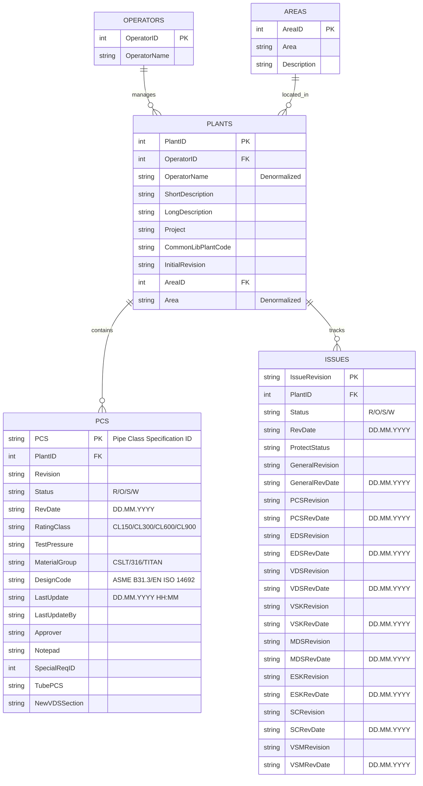

# TR2000 Entity Relationship Diagram

## Database Schema Overview

Based on the TR2000 API analysis, here's the complete entity relationship structure:

## Relationship Details

### Primary Relationships
1. **OPERATORS → PLANTS** (1:N)
   - One operator manages multiple plants
   - Foreign Key: `PLANTS.OperatorID → OPERATORS.OperatorID`

2. **PLANTS → PCS** (1:N)  
   - One plant contains multiple pipe class specifications
   - Foreign Key: `PCS.PlantID → PLANTS.PlantID`

3. **PLANTS → ISSUES** (1:N)
   - One plant tracks multiple issue revisions
   - Foreign Key: `ISSUES.PlantID → PLANTS.PlantID`

4. **AREAS → PLANTS** (1:N)
   - One area contains multiple plants
   - Foreign Key: `PLANTS.AreaID → AREAS.AreaID`
   - Note: /areas endpoint is restricted (403)

### Data Distribution

#### Operators
- **Equinor Europe** (ID: 1): 106 plants
- **Equinor North America** (ID: 7): 10 plants  
- **Equinor Africa** (ID: 8): 0 active plants
- **Others**: Limited or no data

#### Plants by Region
- **Europe**: 106 facilities (major operations)
- **North America**: 10 facilities (Canada/US)
- **Africa**: Operations exist but no plant data
- **Wind Projects**: Operations exist but no plant data

#### Technical Data Volume
- **PCS per major plant**: 200-300+ specifications
- **Issues per plant**: 5-20 revision tracking records
- **Total plants with data**: ~116 active plants

## Status Code Legend

### PCS & Issues Status
- **R**: Released (active/current)
- **O**: Outdated (superseded)
- **S**: Superseded (replaced)
- **W**: Working (draft/in-progress)

### Material Groups (PCS)
- **CSLT**: Carbon Steel Low Temperature
- **316**: Stainless Steel 316
- **TITAN**: Titanium alloy
- **Others**: Various specialized materials

### Rating Classes (PCS)
- **CL150**: 150 lb pressure class (~20 bar)
- **CL300**: 300 lb pressure class (~40 bar)
- **CL600**: 600 lb pressure class (~80 bar)
- **CL900**: 900 lb pressure class (~120 bar)

## Document Types (Issues Tracking)

### Tracked Document Revisions
1. **General**: Overall project documentation
2. **PCS**: Pipe Class Specifications
3. **EDS**: Engineering Design Specifications
4. **VDS**: Valve Design Specifications  
5. **VSK**: Valve Selection Criteria
6. **MDS**: Material Design Specifications
7. **ESK**: Equipment Selection Criteria
8. **SC**: Safety Case documentation
9. **VSM**: Valve Selection Manual

## Implementation Notes

### Database Design Considerations
1. **Denormalized Fields**: API includes denormalized data (OperatorName in PLANTS)
2. **String Dates**: All dates stored as strings in DD.MM.YYYY format
3. **Composite Keys**: Some entities use string-based primary keys
4. **Nullable Fields**: Many optional fields (project, notepad, special requirements)

### API Access Patterns
1. **Hierarchical Access**: Follow operator → plant → specifications pattern
2. **Bulk Operations**: /plants endpoint provides all plant data efficiently  
3. **Filtered Queries**: /operators/{id}/plants allows operator-specific filtering
4. **Detail Queries**: /plants/{id}/pcs and /plants/{id}/issues for technical details

### Data Quality
- **Consistent Schema**: All endpoints follow predictable JSON structure
- **Complete Relationships**: All foreign key references are valid
- **Active Data**: Focus on Equinor Europe for most comprehensive dataset
- **Revision Tracking**: Full audit trail through Issues entity