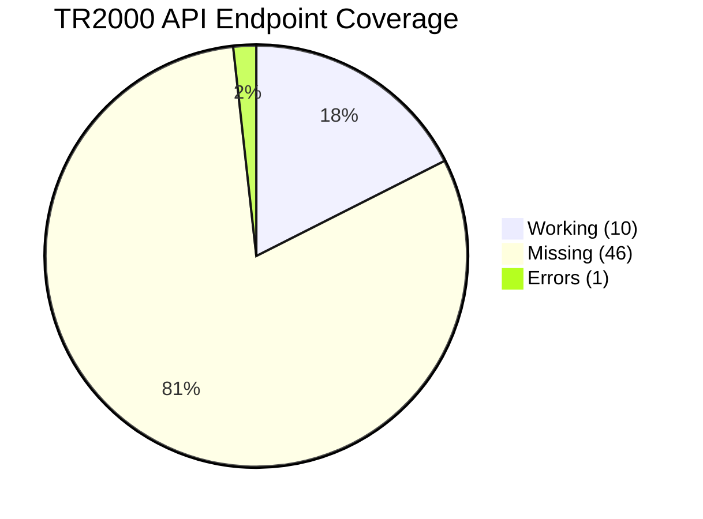
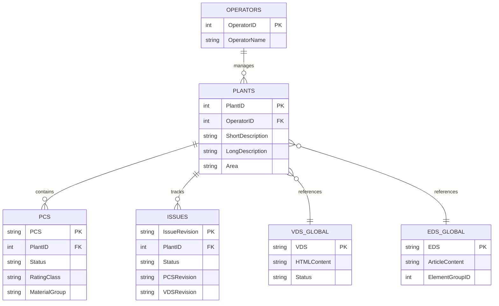
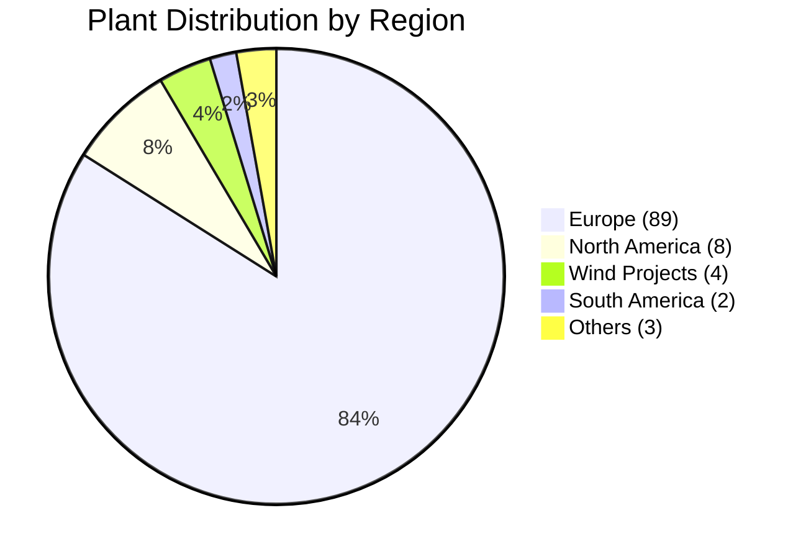
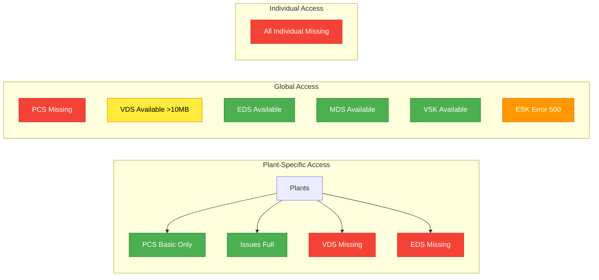
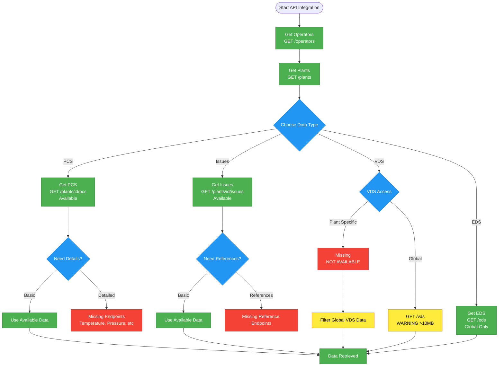
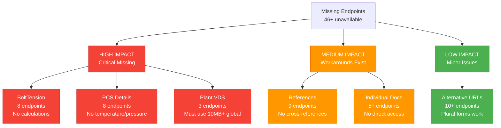
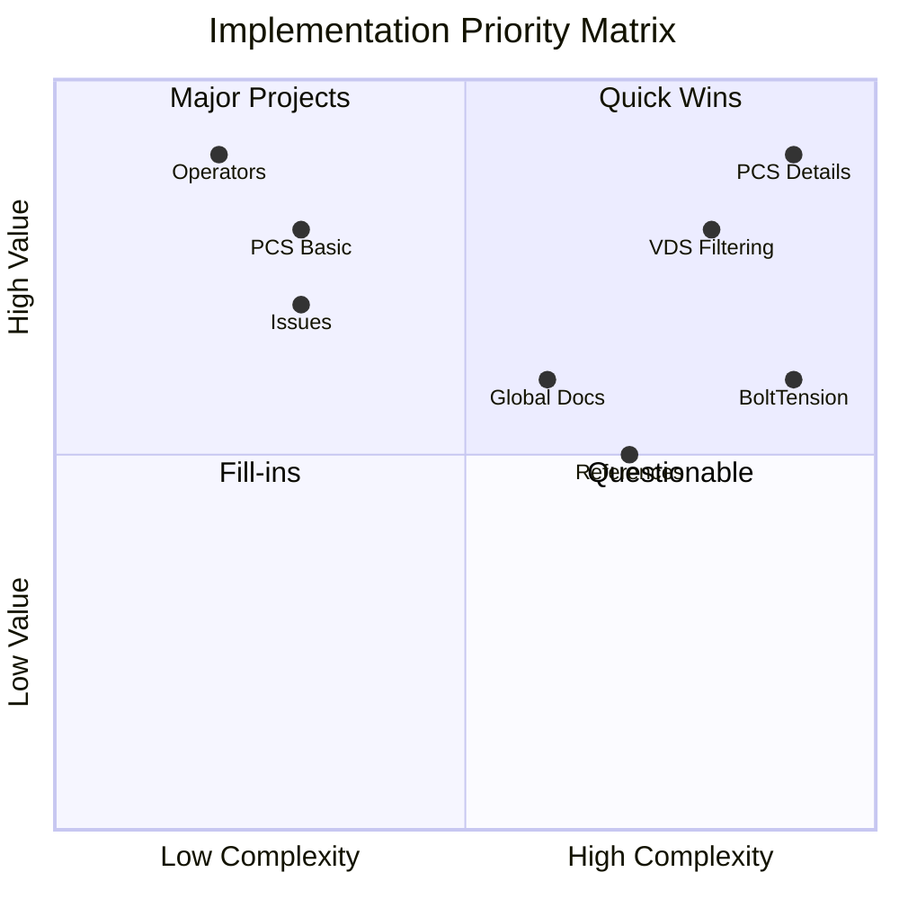

# TR2000 API Visual Charts (Fixed)

## How to View These Charts

### Online Mermaid Editor (Recommended)
1. Go to **https://mermaid.live/**
2. Copy any chart code below (without the ```mermaid wrapper)
3. Paste directly into the editor
4. Charts will render immediately

### VS Code with Extension
1. Install **"Mermaid Markdown Syntax Highlighting"** extension
2. Open this file
3. Press `Ctrl+Shift+V` for preview

---

## Chart 1: API Coverage Overview



---

## Chart 2: Endpoint Status Map

```mermaid
graph TD
    API[TR2000 API]
    
    API --> WE[Working Endpoints - 10]
    API --> ME[Missing Endpoints - 46+]
    API --> EE[Error Endpoints - 1]
    
    WE --> OP[Operators & Plants - 4]
    WE --> DOC[Global Documents - 4]
    WE --> SPEC[Plant Specifications - 2]
    
    OP --> OP1["/operators<br/>8 records"]
    OP --> OP2["/plants<br/>106 records"]
    OP --> OP3["/plants/{id}<br/>Single plant"]
    OP --> OP4["/operators/{id}/plants<br/>By operator"]
    
    DOC --> DOC1["/vds<br/>WARNING: >10MB"]
    DOC --> DOC2["/eds<br/>Engineering specs"]
    DOC --> DOC3["/mds<br/>Material data"]
    DOC --> DOC4["/vsk<br/>Valve specs"]
    
    SPEC --> SPEC1["/plants/{id}/pcs<br/>100+ per plant"]
    SPEC --> SPEC2["/plants/{id}/issues<br/>Revision tracking"]
    
    ME --> BT[BoltTension - 8 endpoints]
    ME --> REF[References - 9 endpoints]
    ME --> PCS_DET[PCS Details - 8 endpoints]
    ME --> VDS_PLANT[VDS Plant - 3 endpoints]
    
    EE --> ESK["/esk - 500 Error"]
    
    classDef working fill:#4CAF50,stroke:#2E7D32,stroke-width:2px,color:#fff
    classDef missing fill:#F44336,stroke:#C62828,stroke-width:2px,color:#fff
    classDef error fill:#FF9800,stroke:#EF6C00,stroke-width:2px,color:#fff
    classDef warning fill:#FFEB3B,stroke:#F57F17,stroke-width:2px,color:#000
    
    class WE,OP,DOC,SPEC,OP1,OP2,OP3,OP4,DOC2,DOC3,DOC4,SPEC1,SPEC2 working
    class ME,BT,REF,PCS_DET,VDS_PLANT missing
    class EE,ESK error
    class DOC1 warning
```



---

## Chart 3: Entity Relationships



---

## Chart 4: Regional Distribution



---

## Chart 5: Document Access Matrix



---

## Chart 6: API Implementation Flow



---

## Chart 7: Missing Functionality Impact



---

## Chart 8: Priority Matrix



---

## Quick Test Instructions

### For Mermaid.live:
1. Copy this code (without the triple backticks):

```
pie title TR2000 API Coverage
    "Working (10)" : 10
    "Missing (46)" : 46
    "Errors (1)" : 1
```

2. Paste into https://mermaid.live/
3. Should render immediately

### For VS Code:
1. Install Mermaid extension
2. Open this file  
3. Use preview mode (Ctrl+Shift+V)

## Color Legend

- 🟢 **Green**: Working endpoints
- 🔴 **Red**: Missing endpoints
- 🟡 **Yellow**: Warnings/limitations
- 🟠 **Orange**: Errors
- 🔵 **Blue**: Informational/decisions

## Summary Stats

- **Total Endpoints Tested**: 57+
- **Working**: 10 (18%)
- **Missing**: 46 (80%)
- **Errors**: 1 (2%)
- **Major Plants**: 3 (Kårstø, Plant 2, Sleipner)
- **Global Coverage**: 106 plants across 8 operators