# TR2000 Enhanced Database ERD & Visual Diagrams

## Overview

This document provides visual representations of the enhanced TR2000 database schema with complete field coverage. The diagrams show the transformation from basic ETL to comprehensive engineering data warehouse.

---

## **Complete Enhanced Database Schema**

---

## **SCD2 Temporal Structure Visualization**

---

## **Enhanced Reference Tables Structure**

---

## **NEW PCS Detail Tables Architecture**

---

## **ETL Data Flow Visualization**

---

## **Field Coverage Enhancement Visualization**

---

## **Table Categories & Color Coding**

```mermaid
graph TD
    subgraph "🎛️ Control Tables (Gray)"
        CT1[ETL_CONTROL]
        CT2[ETL_ENDPOINT_LOG]
        CT3[ETL_ERROR_LOG]
        CT4[ETL_PLANT_LOADER]
        CT5[ETL_ISSUE_LOADER]
        CT6[ETL_RECONCILIATION]
    end
    
    subgraph "📊 Master Data (Green)" 
        MD1[OPERATORS<br/>2 fields]
        MD2[PLANTS<br/>24+ fields - ENHANCED]
        MD3[ISSUES<br/>25+ fields - ENHANCED]
    end
    
    subgraph "🔗 Reference Tables (Blue)"
        RT1[PCS_REFERENCES - ENHANCED]
        RT2[VDS_REFERENCES - ENHANCED]
        RT3[EDS_REFERENCES - ENHANCED]
        RT4[MDS_REFERENCES - ENHANCED]
        RT5[VSK_REFERENCES - ENHANCED]
        RT6[ESK_REFERENCES - ENHANCED]
        RT7[SC_REFERENCES - ENHANCED]
        RT8[VSM_REFERENCES - ENHANCED]
        RT9[PIPE_ELEMENT_REFERENCES - ENHANCED]
    end
    
    subgraph "🔧 PCS Engineering Tables (Gold)"
        ET1[PCS_HEADER<br/>15+ fields - NEW]
        ET2[PCS_TEMP_PRESSURE<br/>70+ fields - NEW]
        ET3[PCS_PIPE_SIZES<br/>11 fields - NEW]
        ET4[PCS_PIPE_ELEMENTS<br/>25+ fields - NEW]
    end
    
    style CT1 fill:#D3D3D3
    style CT2 fill:#D3D3D3
    style CT3 fill:#D3D3D3
    style CT4 fill:#D3D3D3
    style CT5 fill:#D3D3D3
    style CT6 fill:#D3D3D3
    
    style MD1 fill:#90EE90
    style MD2 fill:#90EE90
    style MD3 fill:#90EE90
    
    style RT1 fill:#87CEEB
    style RT2 fill:#87CEEB
    style RT3 fill:#87CEEB
    style RT4 fill:#87CEEB
    style RT5 fill:#87CEEB
    style RT6 fill:#87CEEB
    style RT7 fill:#87CEEB
    style RT8 fill:#87CEEB
    style RT9 fill:#87CEEB
    
    style ET1 fill:#FFD700
    style ET2 fill:#FFD700
    style ET3 fill:#FFD700
    style ET4 fill:#FFD700
```

---

## **Engineering Data Capabilities Matrix**

| Data Category | Before Enhancement | After Enhancement | Business Impact |
|---------------|-------------------|-------------------|-----------------|
| **Plant Configuration** | 5 basic fields | 24+ complete fields | ✅ Full plant setup data |
| **Issue Tracking** | 5 basic fields | 25+ revision matrix | ✅ Complete audit trail |
| **Reference Metadata** | Name/revision only | Complete metadata + user audit | ✅ Full traceability |
| **Engineering Specifications** | ❌ None | ✅ 4 detailed PCS tables | ✅ Design calculations |
| **Temperature/Pressure** | ❌ None | ✅ 12-point matrix | ✅ Engineering analysis |
| **Material Tracking** | ❌ Basic | ✅ Complete specifications | ✅ Material management |
| **User Audit** | ❌ None | ✅ Full user/time tracking | ✅ Compliance ready |

---

## **Key Architectural Benefits**

### 🎯 **Complete API Coverage**
- **100% Field Capture**: All TR2000 API fields now stored
- **No Data Loss**: Complete engineering specifications preserved
- **Future-Proof**: Ready for new API enhancements

### 🔍 **Enhanced Traceability**
- **User Audit**: Who created/modified every record
- **Change Tracking**: Complete SCD2 temporal history
- **Revision Matrix**: Component-level revision tracking

### ⚡ **Engineering Analytics** 
- **Design Calculations**: Pressure/temperature matrices
- **Material Analysis**: Complete material specifications  
- **Performance Monitoring**: Full audit trail for optimization

### 🛡️ **Data Quality & Governance**
- **Validation Framework**: Business rule enforcement
- **Error Persistence**: Autonomous transaction error logging
- **Reconciliation**: Automated count validation

---

*This enhanced database architecture transforms TR2000 from a basic ETL system into a comprehensive engineering data warehouse with complete audit capabilities and full API field coverage.*