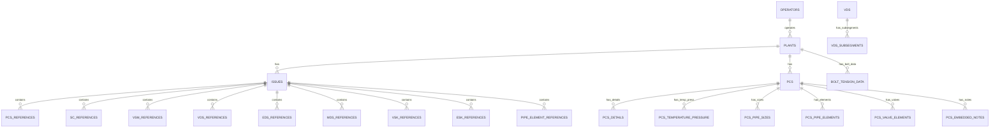

# TR2000 Phase 2: Oracle Staging Database Architecture Plan

## Executive Summary
Phase 2 transforms the API-to-UI application into a comprehensive ETL pipeline that extracts data from TR2000 API endpoints and loads it into an Oracle staging database. This staging database will serve as an intermediate layer before data transformation into the final Aibel PCS database supporting multiple clients.

## Architecture Overview

```
┌─────────────────┐     ┌──────────────────┐     ┌─────────────────┐     ┌──────────────────┐
│  TR2000 API     │────▶│  ETL Process     │────▶│ Oracle Staging  │────▶│  Aibel Final    │
│  (Equinor)      │     │  (Weekly Job)    │     │  Database       │     │  Database       │
└─────────────────┘     └──────────────────┘     └─────────────────┘     └──────────────────┘
                                                   (TR2000 Specific)      (Multi-Client)
```

## 1. Entity Relationship Diagram (ERD)

### Core Entities and Relationships



### Key Design Decisions

1. **Composite Primary Keys**: Use combination of entity identifiers + revision + extraction timestamp
2. **Temporal Data**: Track data changes over time with extraction_date and validity periods
3. **Audit Fields**: Include source system metadata (username, entry_time, protected status)
4. **Client Identification**: Add CLIENT_CODE field for future multi-client support

## 2. Database Schema Design

### 2.1 Control Tables

```sql
-- ETL Control and Monitoring
CREATE TABLE ETL_CONTROL (
    ETL_RUN_ID         NUMBER GENERATED ALWAYS AS IDENTITY PRIMARY KEY,
    RUN_DATE           TIMESTAMP DEFAULT CURRENT_TIMESTAMP,
    RUN_TYPE           VARCHAR2(20),  -- 'FULL', 'INCREMENTAL', 'DELTA'
    STATUS             VARCHAR2(20),  -- 'RUNNING', 'SUCCESS', 'FAILED'
    RECORDS_EXTRACTED  NUMBER,
    RECORDS_LOADED     NUMBER,
    ERROR_COUNT        NUMBER,
    START_TIME         TIMESTAMP,
    END_TIME           TIMESTAMP,
    COMMENTS           VARCHAR2(4000)
);

-- Endpoint Processing Log
CREATE TABLE ETL_ENDPOINT_LOG (
    LOG_ID             NUMBER GENERATED ALWAYS AS IDENTITY PRIMARY KEY,
    ETL_RUN_ID         NUMBER REFERENCES ETL_CONTROL(ETL_RUN_ID),
    ENDPOINT_NAME      VARCHAR2(100),
    PLANT_ID           VARCHAR2(50),
    API_URL            VARCHAR2(500),
    RESPONSE_TIME_MS   NUMBER,
    RECORD_COUNT       NUMBER,
    STATUS             VARCHAR2(20),
    ERROR_MESSAGE      VARCHAR2(4000),
    PROCESSED_DATE     TIMESTAMP DEFAULT CURRENT_TIMESTAMP
);
```

### 2.2 Master Data Tables

```sql
-- Operators Table
CREATE TABLE STG_OPERATORS (
    OPERATOR_ID        NUMBER NOT NULL,
    OPERATOR_NAME      VARCHAR2(200),
    ETL_RUN_ID         NUMBER,
    EXTRACTION_DATE    TIMESTAMP DEFAULT CURRENT_TIMESTAMP,
    IS_CURRENT         CHAR(1) DEFAULT 'Y',
    VALID_FROM         TIMESTAMP,
    VALID_TO           TIMESTAMP,
    CONSTRAINT PK_STG_OPERATORS PRIMARY KEY (OPERATOR_ID, EXTRACTION_DATE)
);

-- Plants Table
CREATE TABLE STG_PLANTS (
    PLANT_ID              VARCHAR2(50) NOT NULL,
    OPERATOR_ID           NUMBER,
    OPERATOR_NAME         VARCHAR2(200),
    SHORT_DESCRIPTION     VARCHAR2(100),
    PROJECT               VARCHAR2(100),
    LONG_DESCRIPTION      VARCHAR2(500),
    COMMON_LIB_PLANT_CODE VARCHAR2(50),
    INITIAL_REVISION      VARCHAR2(20),
    AREA_ID               NUMBER,
    AREA                  VARCHAR2(100),
    CATEGORY_ID           VARCHAR2(50),
    CATEGORY              VARCHAR2(100),
    DOCUMENT_SPACE_LINK   VARCHAR2(500),
    CELSIUS_BAR           VARCHAR2(50),
    VISIBLE               VARCHAR2(10),
    USER_PROTECTED        VARCHAR2(10),
    ETL_RUN_ID            NUMBER,
    EXTRACTION_DATE       TIMESTAMP DEFAULT CURRENT_TIMESTAMP,
    IS_CURRENT            CHAR(1) DEFAULT 'Y',
    CONSTRAINT PK_STG_PLANTS PRIMARY KEY (PLANT_ID, EXTRACTION_DATE)
);
```

### 2.3 Issues and References Tables

```sql
-- Issues Table
CREATE TABLE STG_ISSUES (
    PLANT_ID           VARCHAR2(50) NOT NULL,
    ISSUE_REVISION     VARCHAR2(20) NOT NULL,
    STATUS             VARCHAR2(10),
    REV_DATE           VARCHAR2(20),
    PROTECT_STATUS     VARCHAR2(10),
    GENERAL_REVISION   VARCHAR2(20),
    GENERAL_REV_DATE   VARCHAR2(20),
    PCS_REVISION       VARCHAR2(20),
    PCS_REV_DATE       VARCHAR2(20),
    EDS_REVISION       VARCHAR2(20),
    EDS_REV_DATE       VARCHAR2(20),
    VDS_REVISION       VARCHAR2(20),
    VDS_REV_DATE       VARCHAR2(20),
    VSK_REVISION       VARCHAR2(20),
    VSK_REV_DATE       VARCHAR2(20),
    MDS_REVISION       VARCHAR2(20),
    MDS_REV_DATE       VARCHAR2(20),
    ESK_REVISION       VARCHAR2(20),
    ESK_REV_DATE       VARCHAR2(20),
    SC_REVISION        VARCHAR2(20),
    SC_REV_DATE        VARCHAR2(20),
    VSM_REVISION       VARCHAR2(20),
    VSM_REV_DATE       VARCHAR2(20),
    -- Audit fields from API header
    USER_NAME          VARCHAR2(100),
    USER_ENTRY_TIME    VARCHAR2(50),
    USER_PROTECTED     VARCHAR2(10),
    -- ETL fields
    ETL_RUN_ID         NUMBER,
    EXTRACTION_DATE    TIMESTAMP DEFAULT CURRENT_TIMESTAMP,
    IS_CURRENT         CHAR(1) DEFAULT 'Y',
    CONSTRAINT PK_STG_ISSUES PRIMARY KEY (PLANT_ID, ISSUE_REVISION, EXTRACTION_DATE)
);

-- PCS References Table
CREATE TABLE STG_PCS_REFERENCES (
    PLANT_ID           VARCHAR2(50) NOT NULL,
    ISSUE_REVISION     VARCHAR2(20) NOT NULL,
    PCS                VARCHAR2(100) NOT NULL,
    REVISION           VARCHAR2(20),
    REV_DATE           VARCHAR2(20),
    STATUS             VARCHAR2(10),
    OFFICIAL_REVISION  VARCHAR2(20),
    REVISION_SUFFIX    VARCHAR2(10),
    RATING_CLASS       VARCHAR2(50),
    MATERIAL_GROUP     VARCHAR2(50),
    HISTORICAL_PCS     VARCHAR2(100),
    DELTA              VARCHAR2(10),
    -- Audit fields
    USER_NAME          VARCHAR2(100),
    USER_ENTRY_TIME    VARCHAR2(50),
    USER_PROTECTED     VARCHAR2(10),
    -- ETL fields
    ETL_RUN_ID         NUMBER,
    EXTRACTION_DATE    TIMESTAMP DEFAULT CURRENT_TIMESTAMP,
    CONSTRAINT PK_STG_PCS_REF PRIMARY KEY (PLANT_ID, ISSUE_REVISION, PCS, EXTRACTION_DATE)
);
```

### 2.4 PCS Detail Tables

```sql
-- PCS Master Table
CREATE TABLE STG_PCS (
    PLANT_ID           VARCHAR2(50) NOT NULL,
    PCS                VARCHAR2(100) NOT NULL,
    REVISION           VARCHAR2(20) NOT NULL,
    STATUS             VARCHAR2(10),
    REV_DATE           VARCHAR2(20),
    RATING_CLASS       VARCHAR2(50),
    TEST_PRESSURE      VARCHAR2(50),
    MATERIAL_GROUP     VARCHAR2(50),
    DESIGN_CODE        VARCHAR2(50),
    LAST_UPDATE        VARCHAR2(50),
    LAST_UPDATE_BY     VARCHAR2(100),
    APPROVER           VARCHAR2(100),
    NOTEPAD            CLOB,
    SPECIAL_REQ_ID     NUMBER,
    TUBE_PCS           VARCHAR2(100),
    NEW_VDS_SECTION    VARCHAR2(100),
    -- ETL fields
    ETL_RUN_ID         NUMBER,
    EXTRACTION_DATE    TIMESTAMP DEFAULT CURRENT_TIMESTAMP,
    IS_CURRENT         CHAR(1) DEFAULT 'Y',
    CONSTRAINT PK_STG_PCS PRIMARY KEY (PLANT_ID, PCS, REVISION, EXTRACTION_DATE)
);

-- PCS Pipe Sizes Table
CREATE TABLE STG_PCS_PIPE_SIZES (
    PLANT_ID           VARCHAR2(50) NOT NULL,
    PCS                VARCHAR2(100) NOT NULL,
    REVISION           VARCHAR2(20) NOT NULL,
    NOM_SIZE           VARCHAR2(20) NOT NULL,
    OUTER_DIAM         VARCHAR2(20),
    WALL_THICKNESS     VARCHAR2(20),
    SCHEDULE           VARCHAR2(20),
    UNDER_TOLERANCE    VARCHAR2(20),
    CORROSION_ALLOWANCE VARCHAR2(20),
    WELDING_FACTOR     VARCHAR2(20),
    DIM_ELEMENT_CHANGE VARCHAR2(10),
    SCHEDULE_IN_MATRIX VARCHAR2(20),
    -- ETL fields
    ETL_RUN_ID         NUMBER,
    EXTRACTION_DATE    TIMESTAMP DEFAULT CURRENT_TIMESTAMP,
    CONSTRAINT PK_STG_PCS_SIZES PRIMARY KEY (PLANT_ID, PCS, REVISION, NOM_SIZE, EXTRACTION_DATE)
);
```

### 2.5 VDS Tables

```sql
-- VDS Master Table
CREATE TABLE STG_VDS (
    VDS                VARCHAR2(100) NOT NULL,
    REVISION           VARCHAR2(20) NOT NULL,
    STATUS             VARCHAR2(10),
    REV_DATE           VARCHAR2(20),
    LAST_UPDATE        VARCHAR2(50),
    LAST_UPDATE_BY     VARCHAR2(100),
    DESCRIPTION        VARCHAR2(500),
    NOTEPAD            CLOB,
    SPECIAL_REQ_ID     NUMBER,
    VALVE_TYPE_ID      NUMBER,
    RATING_CLASS_ID    NUMBER,
    MATERIAL_GROUP_ID  NUMBER,
    END_CONNECTION_ID  NUMBER,
    BORE_ID            NUMBER,
    VDS_SIZE_ID        NUMBER,
    SIZE_RANGE         VARCHAR2(100),
    CUSTOM_NAME        VARCHAR2(200),
    SUBSEGMENT_LIST    VARCHAR2(500),
    -- ETL fields
    ETL_RUN_ID         NUMBER,
    EXTRACTION_DATE    TIMESTAMP DEFAULT CURRENT_TIMESTAMP,
    IS_CURRENT         CHAR(1) DEFAULT 'Y',
    CONSTRAINT PK_STG_VDS PRIMARY KEY (VDS, REVISION, EXTRACTION_DATE)
);
```

## 3. ETL Process Design

### 3.1 ETL Architecture

```
┌─────────────────────────────────────────────────────────┐
│                    ETL Orchestrator                      │
│  (C# Console App / Azure Function / Oracle Scheduler)   │
└─────────────────────────────────────────────────────────┘
                            │
        ┌───────────────────┼───────────────────┐
        ▼                   ▼                   ▼
┌──────────────┐   ┌──────────────┐   ┌──────────────┐
│  Extract     │   │  Transform   │   │    Load      │
│  Component   │   │  Component   │   │  Component   │
└──────────────┘   └──────────────┘   └──────────────┘
```

### 3.2 ETL Components

#### 3.2.1 Extract Component
```csharp
public class TR2000Extractor
{
    private readonly HttpClient _httpClient;
    private readonly ILogger _logger;
    
    public async Task<ExtractResult> ExtractEndpoint(
        string endpoint, 
        Dictionary<string, string> parameters)
    {
        // 1. Build API URL
        // 2. Add authentication headers
        // 3. Execute HTTP request with retry logic
        // 4. Parse JSON response
        // 5. Add extraction metadata
        // 6. Return structured data
    }
    
    public async Task<List<ExtractResult>> ExtractAllEndpoints()
    {
        var results = new List<ExtractResult>();
        
        // 1. Get list of all plants
        // 2. For each plant, extract all endpoints
        // 3. Handle pagination if needed
        // 4. Log progress and errors
        
        return results;
    }
}
```

#### 3.2.2 Transform Component
```csharp
public class DataTransformer
{
    public TransformResult Transform(ExtractResult extractedData)
    {
        // 1. Validate data quality
        // 2. Standardize date formats
        // 3. Handle null values
        // 4. Apply business rules
        // 5. Add surrogate keys
        // 6. Calculate derived fields
        // 7. Detect changes (SCD Type 2)
        
        return transformedData;
    }
}
```

#### 3.2.3 Load Component
```csharp
public class OracleLoader
{
    private readonly string _connectionString;
    
    public async Task LoadData(TransformResult data)
    {
        using (var connection = new OracleConnection(_connectionString))
        {
            // 1. Open transaction
            // 2. Disable current records (IS_CURRENT = 'N')
            // 3. Insert new records
            // 4. Update ETL control tables
            // 5. Commit transaction
        }
    }
    
    public async Task BulkLoad(List<TransformResult> data)
    {
        // Use Oracle bulk operations for performance
        // Consider using Oracle External Tables for very large datasets
    }
}
```

### 3.3 ETL Scheduling

#### Option 1: Oracle Scheduler (Recommended)
```sql
BEGIN
  DBMS_SCHEDULER.CREATE_JOB (
    job_name        => 'TR2000_WEEKLY_ETL',
    job_type        => 'STORED_PROCEDURE',
    job_action      => 'PKG_TR2000_ETL.RUN_WEEKLY_EXTRACT',
    start_date      => SYSTIMESTAMP,
    repeat_interval => 'FREQ=WEEKLY; BYDAY=SUN; BYHOUR=2',
    enabled         => TRUE,
    comments        => 'Weekly extraction from TR2000 API'
  );
END;
/
```

#### Option 2: Windows Task Scheduler
- Create C# console application
- Schedule using Windows Task Scheduler
- Log to Windows Event Log

#### Option 3: Azure Functions (Cloud-Native)
- Timer-triggered Azure Function
- Scalable and serverless
- Built-in monitoring with Application Insights

## 4. Data Quality and Validation

### 4.1 Pre-Load Validation
```sql
CREATE TABLE ETL_VALIDATION_RULES (
    RULE_ID            NUMBER PRIMARY KEY,
    TABLE_NAME         VARCHAR2(100),
    COLUMN_NAME        VARCHAR2(100),
    RULE_TYPE          VARCHAR2(50),  -- 'NOT_NULL', 'UNIQUE', 'RANGE', 'REGEX', 'REFERENTIAL'
    RULE_EXPRESSION    VARCHAR2(1000),
    ERROR_SEVERITY     VARCHAR2(20),  -- 'ERROR', 'WARNING', 'INFO'
    IS_ACTIVE          CHAR(1) DEFAULT 'Y'
);

-- Example validation rules
INSERT INTO ETL_VALIDATION_RULES VALUES 
(1, 'STG_PLANTS', 'PLANT_ID', 'NOT_NULL', 'PLANT_ID IS NOT NULL', 'ERROR', 'Y'),
(2, 'STG_ISSUES', 'REV_DATE', 'REGEX', '^[0-9]{2}\.[0-9]{2}\.[0-9]{4}$', 'WARNING', 'Y'),
(3, 'STG_PCS', 'STATUS', 'RANGE', "STATUS IN ('R', 'O', 'H', 'D')", 'ERROR', 'Y');
```

### 4.2 Post-Load Reconciliation
```sql
CREATE OR REPLACE PROCEDURE SP_RECONCILE_ETL_RUN(p_etl_run_id NUMBER) AS
BEGIN
    -- Compare record counts
    -- Verify referential integrity
    -- Check for duplicates
    -- Validate business rules
    -- Generate reconciliation report
END;
/
```

## 5. Change Data Capture (CDC)

### 5.1 Slowly Changing Dimensions (SCD) Type 2
```sql
-- Track historical changes
CREATE OR REPLACE PROCEDURE SP_APPLY_SCD2(
    p_table_name VARCHAR2,
    p_key_columns VARCHAR2,
    p_etl_run_id NUMBER
) AS
BEGIN
    -- 1. Identify changed records
    -- 2. Close previous version (set VALID_TO, IS_CURRENT = 'N')
    -- 3. Insert new version (set VALID_FROM, IS_CURRENT = 'Y')
END;
/
```

### 5.2 Delta Detection
```sql
CREATE TABLE ETL_DELTA_LOG (
    DELTA_ID           NUMBER GENERATED ALWAYS AS IDENTITY PRIMARY KEY,
    TABLE_NAME         VARCHAR2(100),
    RECORD_KEY         VARCHAR2(500),
    CHANGE_TYPE        VARCHAR2(20),  -- 'INSERT', 'UPDATE', 'DELETE'
    OLD_VALUES         CLOB,
    NEW_VALUES         CLOB,
    ETL_RUN_ID         NUMBER,
    DETECTED_DATE      TIMESTAMP DEFAULT CURRENT_TIMESTAMP
);
```

## 6. Error Handling and Recovery

### 6.1 Error Handling Strategy
```csharp
public class ETLErrorHandler
{
    public void HandleError(Exception ex, string context)
    {
        // 1. Log error details
        // 2. Send alert notifications
        // 3. Attempt recovery if possible
        // 4. Mark records for manual review
        // 5. Continue processing if non-critical
    }
}
```

### 6.2 Recovery Procedures
```sql
-- Rollback partial loads
CREATE OR REPLACE PROCEDURE SP_ROLLBACK_ETL_RUN(p_etl_run_id NUMBER) AS
BEGIN
    -- Delete records from staging tables
    DELETE FROM STG_OPERATORS WHERE ETL_RUN_ID = p_etl_run_id;
    DELETE FROM STG_PLANTS WHERE ETL_RUN_ID = p_etl_run_id;
    -- ... repeat for all tables
    
    -- Update control table
    UPDATE ETL_CONTROL 
    SET STATUS = 'ROLLED_BACK' 
    WHERE ETL_RUN_ID = p_etl_run_id;
    
    COMMIT;
END;
/
```

## 7. Performance Optimization

### 7.1 Indexing Strategy
```sql
-- Primary indexes for lookup performance
CREATE INDEX IDX_STG_PLANTS_CURRENT ON STG_PLANTS(IS_CURRENT, PLANT_ID);
CREATE INDEX IDX_STG_ISSUES_PLANT ON STG_ISSUES(PLANT_ID, IS_CURRENT);
CREATE INDEX IDX_STG_PCS_PLANT ON STG_PCS(PLANT_ID, PCS, IS_CURRENT);

-- Partitioning for large tables
CREATE TABLE STG_PCS_PIPE_ELEMENTS (
    -- columns...
) PARTITION BY RANGE (EXTRACTION_DATE) 
INTERVAL (NUMTOYMINTERVAL(1, 'MONTH'))
(PARTITION P_INITIAL VALUES LESS THAN (DATE '2025-01-01'));
```

### 7.2 Parallel Processing
```csharp
public async Task ExtractInParallel()
{
    var plants = await GetAllPlants();
    
    // Process plants in parallel batches
    var tasks = plants
        .Batch(5) // Process 5 plants at a time
        .Select(batch => ProcessPlantBatch(batch));
    
    await Task.WhenAll(tasks);
}
```

## 8. Monitoring and Alerting

### 8.1 Monitoring Dashboard Views
```sql
CREATE VIEW V_ETL_DASHBOARD AS
SELECT 
    RUN_DATE,
    STATUS,
    RECORDS_EXTRACTED,
    RECORDS_LOADED,
    ERROR_COUNT,
    ROUND((END_TIME - START_TIME) * 24 * 60, 2) AS DURATION_MINUTES
FROM ETL_CONTROL
ORDER BY ETL_RUN_ID DESC;

CREATE VIEW V_ETL_ERROR_SUMMARY AS
SELECT 
    ENDPOINT_NAME,
    COUNT(*) AS ERROR_COUNT,
    MAX(PROCESSED_DATE) AS LAST_ERROR_DATE
FROM ETL_ENDPOINT_LOG
WHERE STATUS = 'ERROR'
GROUP BY ENDPOINT_NAME;
```

### 8.2 Alert Configuration
```sql
CREATE TABLE ETL_ALERTS (
    ALERT_ID           NUMBER PRIMARY KEY,
    ALERT_TYPE         VARCHAR2(50),
    THRESHOLD_VALUE    NUMBER,
    EMAIL_RECIPIENTS   VARCHAR2(500),
    IS_ACTIVE          CHAR(1) DEFAULT 'Y'
);

-- Alert examples
INSERT INTO ETL_ALERTS VALUES 
(1, 'ERROR_COUNT', 10, 'etl-team@aibel.com', 'Y'),
(2, 'DURATION_EXCEEDED', 120, 'ops-team@aibel.com', 'Y'),
(3, 'NO_DATA_EXTRACTED', 0, 'data-team@aibel.com', 'Y');
```

## 9. Future Considerations for Multi-Client Architecture

### 9.1 Client Segregation
```sql
-- Add client identifier to all tables
ALTER TABLE STG_PLANTS ADD (
    CLIENT_CODE        VARCHAR2(20) DEFAULT 'TR2000',
    CLIENT_NAME        VARCHAR2(100) DEFAULT 'Equinor'
);

-- Create client configuration table
CREATE TABLE CLIENT_CONFIG (
    CLIENT_CODE        VARCHAR2(20) PRIMARY KEY,
    CLIENT_NAME        VARCHAR2(100),
    API_BASE_URL       VARCHAR2(500),
    API_KEY            VARCHAR2(500),
    IS_ACTIVE          CHAR(1) DEFAULT 'Y',
    ETL_SCHEDULE       VARCHAR2(100)
);
```

### 9.2 Data Transformation to Final Schema
```sql
-- Mapping table for client-specific transformations
CREATE TABLE CLIENT_FIELD_MAPPING (
    CLIENT_CODE        VARCHAR2(20),
    SOURCE_TABLE       VARCHAR2(100),
    SOURCE_FIELD       VARCHAR2(100),
    TARGET_TABLE       VARCHAR2(100),
    TARGET_FIELD       VARCHAR2(100),
    TRANSFORM_RULE     VARCHAR2(1000)
);
```

## 10. Implementation Roadmap

### Phase 2.1: Foundation (Week 1-2)
- [ ] Create Oracle staging database schema
- [ ] Set up ETL control tables
- [ ] Implement basic extraction for operators and plants
- [ ] Test database connectivity

### Phase 2.2: Core ETL (Week 3-4)
- [ ] Implement extraction for all endpoints
- [ ] Add transformation logic
- [ ] Implement bulk loading
- [ ] Add error handling

### Phase 2.3: Data Quality (Week 5)
- [ ] Implement validation rules
- [ ] Add reconciliation procedures
- [ ] Create data quality reports

### Phase 2.4: Automation (Week 6)
- [ ] Set up scheduling
- [ ] Implement monitoring
- [ ] Configure alerts
- [ ] Create operational dashboard

### Phase 2.5: Testing & Optimization (Week 7-8)
- [ ] Performance testing
- [ ] Load testing with full data
- [ ] Optimize slow queries
- [ ] Document procedures

## 11. Technology Stack Recommendations

### Primary Stack (Oracle-Centric)
- **Database**: Oracle 19c or later
- **ETL Tool**: Oracle Data Integrator (ODI) or custom C#/.NET
- **Scheduling**: Oracle Scheduler
- **Monitoring**: Oracle Enterprise Manager

### Alternative Stack (Modern/Cloud)
- **Database**: Oracle Autonomous Database
- **ETL Tool**: Azure Data Factory or Apache Airflow
- **Scheduling**: Azure Functions or Kubernetes CronJobs
- **Monitoring**: Application Insights or Grafana

### Development Tools
- **API Testing**: Postman
- **Database IDE**: Oracle SQL Developer or DBeaver
- **Version Control**: Git
- **CI/CD**: Azure DevOps or Jenkins

## 12. Security Considerations

### 12.1 API Security
- Store API keys in Oracle Wallet or Azure Key Vault
- Implement API rate limiting logic
- Use service accounts for authentication
- Rotate credentials regularly

### 12.2 Database Security
- Encrypt sensitive data at rest
- Use SSL/TLS for data in transit
- Implement row-level security for multi-client
- Regular security audits

### 12.3 Audit Trail
```sql
CREATE TABLE ETL_AUDIT_LOG (
    AUDIT_ID           NUMBER GENERATED ALWAYS AS IDENTITY PRIMARY KEY,
    ACTION_TYPE        VARCHAR2(50),
    TABLE_NAME         VARCHAR2(100),
    RECORD_COUNT       NUMBER,
    USER_NAME          VARCHAR2(100),
    ACTION_DATE        TIMESTAMP DEFAULT CURRENT_TIMESTAMP,
    IP_ADDRESS         VARCHAR2(50),
    COMMENTS           VARCHAR2(4000)
);
```

## Conclusion

This comprehensive plan provides a robust foundation for implementing Phase 2 of the TR2000 project. The staging database design supports:

1. **Full data extraction** from all TR2000 API endpoints
2. **Historical tracking** with temporal data management
3. **Data quality** validation and monitoring
4. **Scalability** for future multi-client architecture
5. **Operational excellence** with comprehensive logging and alerting

The modular design allows for incremental implementation while maintaining data integrity and providing clear migration path to the final Aibel database architecture.


  📋 Deliverables Created:

  1. PHASE2_ORACLE_STAGING_PLAN.md - Complete architectural plan including:
    - Entity Relationship Diagram (ERD) design
    - ETL process architecture
    - Data quality framework
    - Performance optimization strategies
    - Multi-client architecture considerations
    - Implementation roadmap (8-week timeline)
  2. Oracle_DDL_Scripts.sql - Production-ready DDL scripts with:
    - 50+ staging tables for all API endpoints
    - ETL control and monitoring tables
    - Data quality validation framework
    - SCD Type 2 implementation for historical tracking
    - Performance indexes and views
    - Stored procedures for ETL operations

  🏗️ Key Architecture Decisions:

  1. Staging Database Design:
    - Temporal data management (IS_CURRENT, VALID_FROM/TO)
    - Composite primary keys with extraction timestamp
    - Hash values for change detection
    - Full audit trail with API metadata
  2. ETL Strategy:
    - Weekly extraction schedule
    - Parallel processing for performance
    - Comprehensive error handling and recovery
    - Data quality validation at multiple stages
  3. Future-Proofing:
    - CLIENT_CODE fields for multi-client support
    - Modular design for easy extension
    - Clear separation between staging and final schemas

  🚀 Next Steps:

  1. Review and approve the architecture with your team
  2. Set up Oracle database with provided DDL scripts
  3. Implement ETL components (C# console app recommended)
  4. Configure scheduling (Oracle Scheduler, Windows Task Scheduler, or Azure Functions)
  5. Test with sample data before full production rollout

  💡 Recommendations:

  - Start with a pilot implementation using 2-3 key endpoints
  - Implement incremental loading after initial full load
  - Consider Oracle partitioning for tables > 10M records
  - Set up monitoring dashboards early for visibility

  The architecture supports your goal of creating a staging database that can handle TR2000 data as one client source, with clear path to transform data into your final multi-client Aibel PCS database.