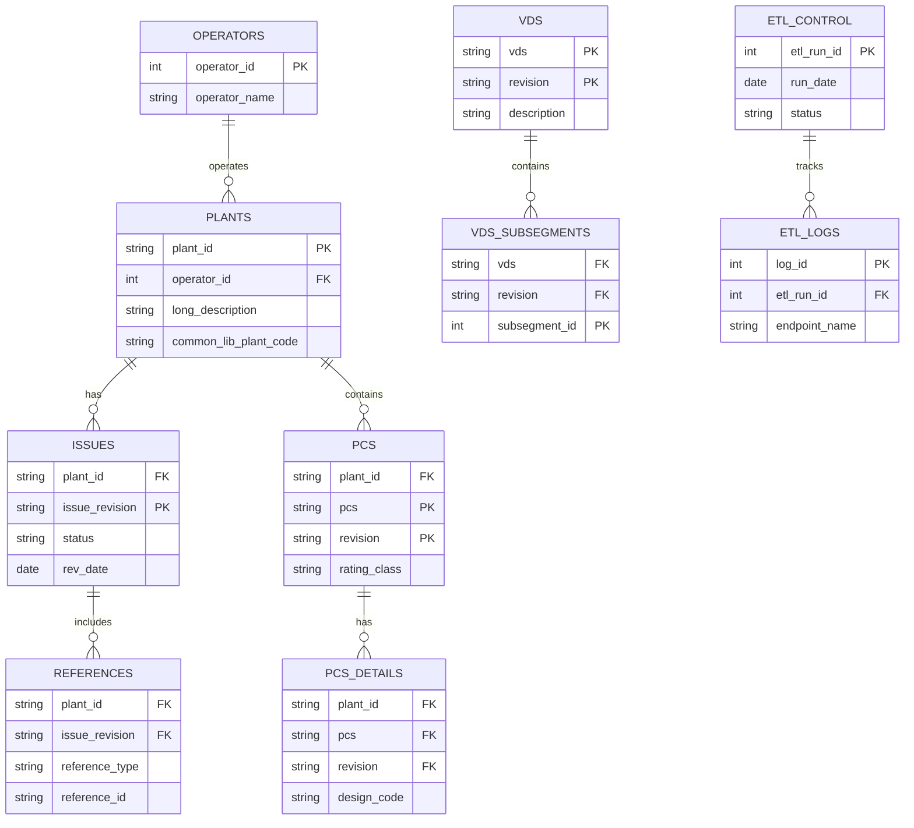
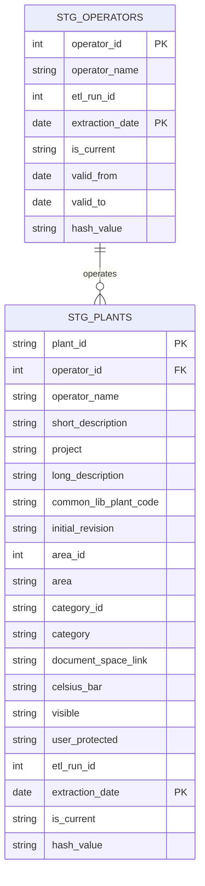
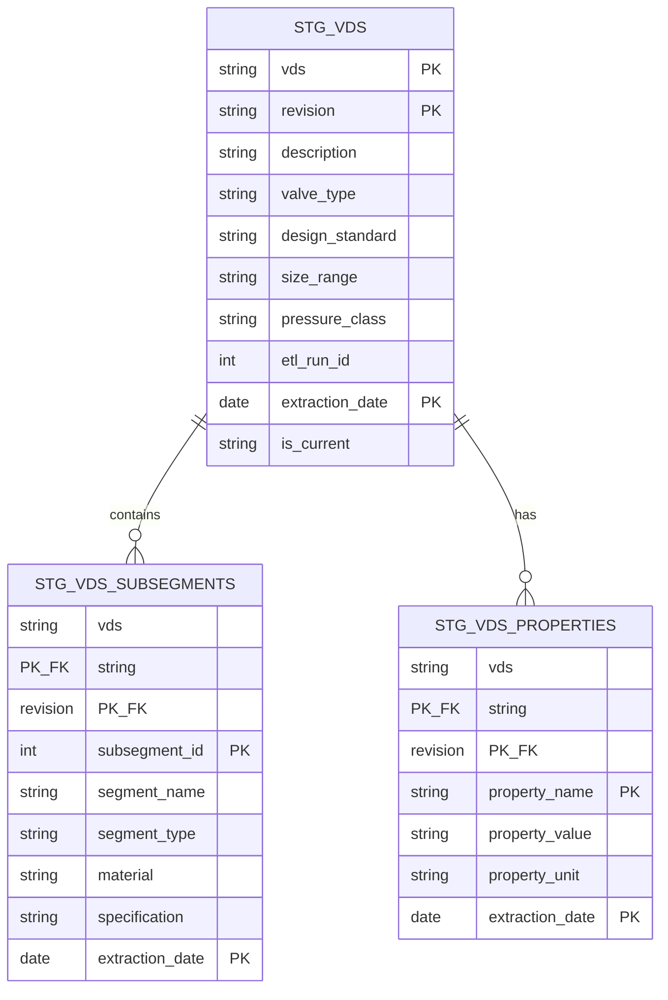
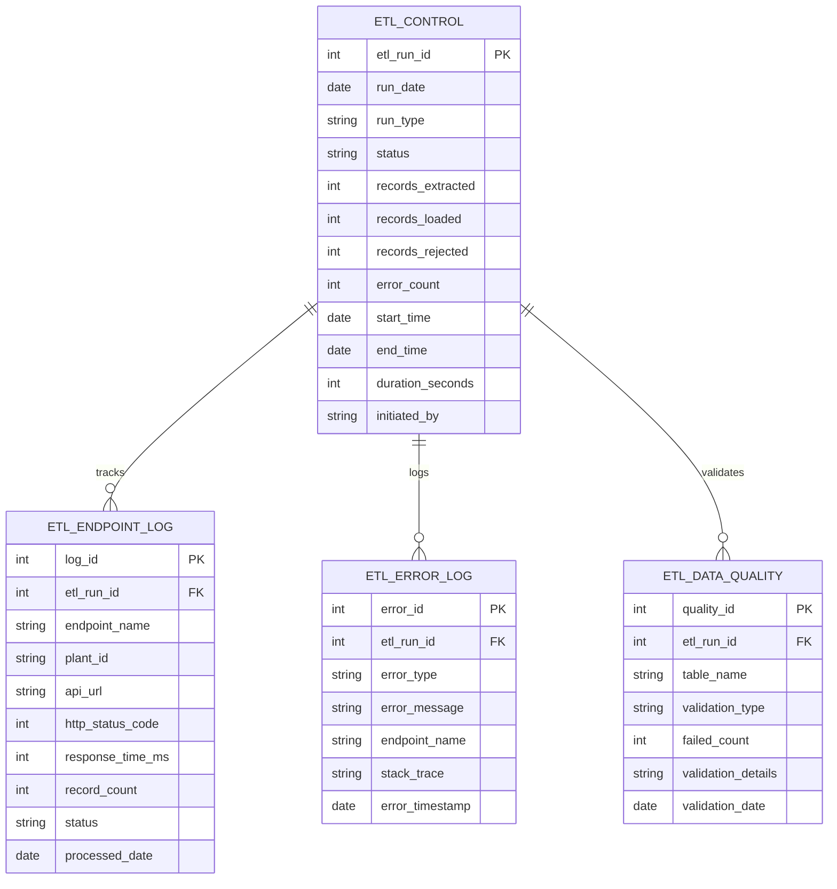

# TR2000 Phase 2: Entity Relationship Diagrams

## Overview - System ERD



## Master Data - Operators and Plants



## Issues and References

```mermaid
erDiagram
    STG_PLANTS ||--o{ STG_ISSUES : has
    STG_ISSUES ||--o{ STG_PCS_REFERENCES : references
    STG_ISSUES ||--o{ STG_MDS_REFERENCES : references
    STG_ISSUES ||--o{ STG_PIPE_ELEMENT_REFERENCES : includes
    
    STG_PLANTS {
        string plant_id PK
        string long_description
        date extraction_date PK
    }
    
    STG_ISSUES {
        string plant_id PK_FK
        string issue_revision PK
        string status
        string rev_date
        string pcs_revision
        string vds_revision
        string mds_revision
        string user_name
        string user_entry_time
        int etl_run_id
        date extraction_date PK
    }
    
    STG_PCS_REFERENCES {
        string plant_id PK_FK
        string issue_revision PK_FK
        string pcs PK
        string revision PK
        string status
        string rating_class
        string material_group
        string delta
        date extraction_date PK
    }
    
    STG_MDS_REFERENCES {
        string plant_id PK_FK
        string issue_revision PK_FK
        string mds PK
        string revision PK
        string area
        string status
        string delta
        date extraction_date PK
    }
    
    STG_PIPE_ELEMENT_REFERENCES {
        string plant_id PK_FK
        string issue_revision PK_FK
        int element_id PK
        string element_group
        string dimension_standard
        string material_grade
        date extraction_date PK
    }
```

## PCS (Piping Class Specification) Main

```mermaid
erDiagram
    STG_PLANTS ||--o{ STG_PCS : contains
    STG_PCS ||--|| STG_PCS_PROPERTIES : has
    STG_PCS ||--|| STG_PCS_TEMP_PRESSURE : has
    STG_PCS ||--o{ STG_PCS_PIPE_SIZES : defines
    
    STG_PLANTS {
        string plant_id PK
        string long_description
        date extraction_date PK
    }
    
    STG_PCS {
        string plant_id PK_FK
        string pcs PK
        string revision PK
        string status
        string rating_class
        string material_group
        string design_code
        string last_update
        string last_update_by
        date extraction_date PK
    }
    
    STG_PCS_PROPERTIES {
        string plant_id PK_FK
        string pcs PK_FK
        string revision PK_FK
        string sc
        string vsm
        int corr_allowance
        string service_remark
        date extraction_date PK
    }
    
    STG_PCS_TEMP_PRESSURE {
        string plant_id PK_FK
        string pcs PK_FK
        string revision PK_FK
        string temperature
        string pressure
        date extraction_date PK
    }
    
    STG_PCS_PIPE_SIZES {
        string plant_id PK_FK
        string pcs PK_FK
        string revision PK_FK
        string nom_size PK
        string outer_diam
        string wall_thickness
        string schedule
        date extraction_date PK
    }
```

## PCS Detail Tables

```mermaid
erDiagram
    STG_PCS ||--o{ STG_PCS_PIPE_ELEMENTS : contains
    STG_PCS ||--o{ STG_PCS_VALVE_ELEMENTS : contains
    STG_PCS ||--o{ STG_PCS_EMBEDDED_NOTES : has
    STG_PCS ||--o{ STG_PCS_MANUFACTURERS : has
    
    STG_PCS {
        string plant_id PK
        string pcs PK
        string revision PK
        string rating_class
        date extraction_date PK
    }
    
    STG_PCS_PIPE_ELEMENTS {
        string plant_id PK_FK
        string pcs PK_FK
        string revision PK_FK
        int element_id PK
        string element_group
        string dimension_standard
        string material_grade
        string component_code
        string material_code
        date extraction_date PK
    }
    
    STG_PCS_VALVE_ELEMENTS {
        string plant_id PK_FK
        string pcs PK_FK
        string revision PK_FK
        int valve_id PK
        string valve_type
        string valve_class
        string body_material
        string end_connection
        date extraction_date PK
    }
    
    STG_PCS_EMBEDDED_NOTES {
        string plant_id PK_FK
        string pcs PK_FK
        string revision PK_FK
        int note_id PK
        string note_type
        string note_text
        string created_by
        date extraction_date PK
    }
    
    STG_PCS_MANUFACTURERS {
        string plant_id PK_FK
        string pcs PK_FK
        string revision PK_FK
        int manufacturer_id PK
        string manufacturer_name
        string component_type
        date extraction_date PK
    }
```

## VDS (Valve Datasheet)



## Bolt Tension

```mermaid
erDiagram
    STG_PLANTS ||--o{ STG_BOLT_TENSION_SPEC : uses
    STG_BOLT_TENSION_SPEC ||--o{ STG_BOLT_TENSION_DETAIL : contains
    STG_BOLT_TENSION_SPEC ||--o{ STG_BOLT_TENSION_TABLE : has
    
    STG_PLANTS {
        string plant_id PK
        string common_lib_plant_code UK
        date extraction_date PK
    }
    
    STG_BOLT_TENSION_SPEC {
        string plant_code PK_FK
        string flange_standard PK
        string bolt_spec
        string gasket_type
        string design_code
        int etl_run_id
        date extraction_date PK
    }
    
    STG_BOLT_TENSION_DETAIL {
        string plant_code PK_FK
        string flange_standard PK_FK
        string flange_size PK
        string pressure_rating PK
        string bolt_size
        int num_bolts
        decimal target_stress
        date extraction_date PK
    }
    
    STG_BOLT_TENSION_TABLE {
        string plant_code PK_FK
        string flange_standard PK_FK
        string table_type PK
        string table_data
        date extraction_date PK
    }
```

## ETL Control and Monitoring



## Complete System - Simplified View

```mermaid
erDiagram
    OPERATORS ||--o{ PLANTS : operates
    PLANTS ||--o{ ISSUES : has
    PLANTS ||--o{ PCS : contains
    PLANTS ||--o{ BOLT_TENSION : uses
    ISSUES ||--o{ PCS_REF : references
    ISSUES ||--o{ SC_REF : references
    ISSUES ||--o{ VSM_REF : references
    ISSUES ||--o{ VDS_REF : references
    ISSUES ||--o{ EDS_REF : references
    ISSUES ||--o{ MDS_REF : references
    ISSUES ||--o{ VSK_REF : references
    ISSUES ||--o{ ESK_REF : references
    ISSUES ||--o{ PIPE_ELEM_REF : includes
    PCS ||--o{ PCS_PROPERTIES : has
    PCS ||--o{ PCS_TEMP_PRESSURE : has
    PCS ||--o{ PCS_PIPE_SIZES : defines
    PCS ||--o{ PCS_PIPE_ELEMENTS : contains
    PCS ||--o{ PCS_VALVE_ELEMENTS : contains
    PCS ||--o{ PCS_EMBEDDED_NOTES : includes
    VDS ||--o{ VDS_SUBSEGMENTS : contains
    VDS ||--o{ VDS_PROPERTIES : has
    BOLT_TENSION ||--o{ BOLT_DETAIL : contains
    ETL_CONTROL ||--o{ ETL_LOGS : tracks
    ETL_CONTROL ||--o{ ALL_STAGING_TABLES : populates
    
    OPERATORS {
        int id PK
        string name
    }
    
    PLANTS {
        string id PK
        int operator_id FK
        string common_lib_code
    }
    
    ISSUES {
        string plant_id FK
        string revision PK
    }
    
    PCS {
        string plant_id FK
        string pcs PK
        string revision PK
    }
    
    PCS_REF {
        string plant_id FK
        string issue_rev FK
        string pcs FK
    }
    
    SC_REF {
        string plant_id FK
        string issue_rev FK
        string sc
    }
    
    VSM_REF {
        string plant_id FK
        string issue_rev FK
        string vsm
    }
    
    VDS_REF {
        string plant_id FK
        string issue_rev FK
        string vds FK
    }
    
    EDS_REF {
        string plant_id FK
        string issue_rev FK
        string eds
    }
    
    MDS_REF {
        string plant_id FK
        string issue_rev FK
        string mds
    }
    
    VSK_REF {
        string plant_id FK
        string issue_rev FK
        string vsk
    }
    
    ESK_REF {
        string plant_id FK
        string issue_rev FK
        string esk
    }
    
    PIPE_ELEM_REF {
        string plant_id FK
        string issue_rev FK
        int element_id PK
    }
    
    PCS_PROPERTIES {
        string plant_id FK
        string pcs FK
        string revision FK
    }
    
    PCS_TEMP_PRESSURE {
        string plant_id FK
        string pcs FK
        string revision FK
    }
    
    PCS_PIPE_SIZES {
        string plant_id FK
        string pcs FK
        string nom_size PK
    }
    
    PCS_PIPE_ELEMENTS {
        string plant_id FK
        string pcs FK
        int element_id PK
    }
    
    PCS_VALVE_ELEMENTS {
        string plant_id FK
        string pcs FK
        int valve_id PK
    }
    
    PCS_EMBEDDED_NOTES {
        string plant_id FK
        string pcs FK
        int note_id PK
    }
    
    VDS {
        string vds PK
        string revision PK
    }
    
    VDS_SUBSEGMENTS {
        string vds FK
        int subsegment_id PK
    }
    
    VDS_PROPERTIES {
        string vds FK
        string property PK
    }
    
    BOLT_TENSION {
        string plant_code FK
        string standard PK
    }
    
    BOLT_DETAIL {
        string plant_code FK
        string flange_size PK
    }
    
    ETL_CONTROL {
        int run_id PK
        string status
    }
    
    ETL_LOGS {
        int log_id PK
        int run_id FK
    }
    
    ALL_STAGING_TABLES {
        int etl_run_id FK
        date extract_date
    }
```



## Notes

- **PK** = Primary Key
- **FK** = Foreign Key  
- **PK_FK** = Field is both a Primary Key and Foreign Key
- **UK** = Unique Key

### Key Relationships:
1. **Operators → Plants**: One operator can operate multiple plants
2. **Plants → Issues**: Each plant has multiple issue revisions
3. **Issues → References**: Each issue contains references to various specifications (PCS, SC, VSM, VDS, EDS, MDS, VSK, ESK)
4. **Plants → PCS**: Each plant contains multiple PCS specifications
5. **PCS → Details**: Each PCS has associated properties, temperature/pressure specs, pipe sizes, elements, valves, and notes
6. **VDS**: Global valve datasheets (not plant-specific) with subsegments and properties
7. **Bolt Tension**: Linked to plants via common_lib_plant_code
8. **ETL Control**: Tracks all data extraction runs with detailed logging

### Temporal Data Management:
- Most staging tables include `extraction_date` as part of composite primary key
- `is_current` flag indicates latest version
- `valid_from` and `valid_to` for historical tracking
- `hash_value` for change detection