# TR2000 Entity Relationship Diagram (ERD)

## Overview
This ERD represents the data structure and relationships derived from the TR2000 API endpoints.

## ERD Diagram

```mermaid
erDiagram
    OPERATOR {
        Int32 OperatorID PK
        String OperatorName
    }
    
    PLANT {
        String PlantID PK
        Int32 OperatorID FK
        String ShortDescription
        String Project
        String LongDescription
        String CommonLibPlantCode
        String InitialRevision
        Int32 AreaID FK
        Int32 CategoryID
        String DocumentSpaceLink
        String EnableCopyPCSFromPlant
        String EnableEmbeddedNote
        String PCSQA
        String EDSMJ
        String CelsiusBar
        String WebInfoText
        String BoltTensionText
        String WindowsRemarkText
        String Visible
        String UserProtected
    }
    
    AREA {
        Int32 AreaID PK
        String Area
    }
    
    ISSUE_REVISION {
        String PlantID FK
        String IssueRevision PK
        String Status
        String RevDate
        String ProtectStatus
        String GeneralRevision
        String GeneralRevDate
        String PCSRevision
        String PCSRevDate
        String EDSRevision
        String EDSRevDate
        String VDSRevision
        String VDSRevDate
        String VSKRevision
        String VSKRevDate
        String MDSRevision
        String MDSRevDate
        String ESKRevision
        String ESKRevDate
        String SCRevision
        String SCRevDate
        String VSMRevision
        String VSMRevDate
        String UserName
        String UserEntryTime
        String UserProtected
    }
    
    PCS {
        String PlantID FK
        String PCS PK
        String Revision PK
        String Status
        String RevDate
        String RatingClass FK
        Int32 MaterialGroupID FK
        String DesignCode
        String TestPressure
        String LastUpdate
        String LastUpdateBy
        String Approver
        String Notepad
        Int32 SpecialReqID FK
        String TubePCS
        String NewVDSSection
        String SC FK
        String VSM FK
        Int32 CorrAllowance
        String LongWeldEff
        String WallThkTol
        String ServiceRemark
        String EDSMJMatrix
        Int32 MJReductionFactor
    }
    
    PCS_TEMP_PRESSURE {
        String PCS FK
        String Revision FK
        String Temperature
        String Pressure
    }
    
    PCS_PIPE_SIZE {
        String PCS FK
        String Revision FK
        String NomSize
        String OuterDiam
        String WallThickness
        String Schedule
        String UnderTolerance
        String CorrosionAllowance
        String WeldingFactor
        String DimElementChange
        String ScheduleInMatrix
    }
    
    PCS_PIPE_ELEMENT {
        String PCS FK
        String Revision FK
        Int32 MaterialGroupID FK
        Int32 ElementGroupNo
        Int32 LineNo
        String Element
        String DimStandard
        String FromSize
        String ToSize
        String ProductForm
        String Material
        String MDS FK
        String EDS FK
        String EDSRevision
        String ESK FK
        String Revmark
        String Remark
        String PageBreak
        Int32 ElementID PK
        String FreeText
        String NoteID
        String NewDeletedLine
        String InitialInfo
        String InitialRevmark
        String MDSVariant
        String MDSRevision
        String Area
    }
    
    PCS_VALVE_ELEMENT {
        String PCS FK
        String Revision FK
        Int32 ValveGroupNo
        Int32 LineNo
        String ValveType
        String VDS FK
        String ValveDescription
        String FromSize
        String ToSize
        String Revmark
        String Remark
        String PageBreak
        String NoteID
        String PreviousVDS
        String NewDeletedLine
        String InitialInfo
        String InitialRevmark
        String SizeRange
        String Status
    }
    
    PCS_EMBEDDED_NOTE {
        String PCSName FK
        String Revision FK
        String TextSectionID
        String TextSectionDescription
        String PageBreak
        String HTMLCLOB
    }
    
    VDS {
        String VDS PK
        String Revision PK
        String Status
        String RevDate
        String LastUpdate
        String LastUpdateBy
        String Description
        String Notepad
        Int32 SpecialReqID FK
        Int32 ValveTypeID FK
        Int32 RatingClassID FK
        Int32 MaterialGroupID FK
        Int32 EndConnectionID FK
        Int32 BoreID FK
        Int32 VDSSizeID FK
        String SizeRange
        String CustomName
        String SubsegmentList
    }
    
    VDS_SUBSEGMENT {
        String VDS FK
        String Revision FK
        Int32 SubsegmentID PK
        String SubsegmentName
        Int32 Sequence
        Int32 ValveTypeID FK
        Int32 RatingClassID FK
        Int32 MaterialTypeID FK
        Int32 EndConnectionID FK
        String FullReducedBoreIndicator
        Int32 BoreID FK
        Int32 VDSSizeID FK
        String HousingDesignIndicator
        Int32 HousingDesignID FK
        Int32 SpecialReqID FK
        Int32 MinOperatingTemperature
        Int32 MaxOperatingTemperature
    }
    
    SC {
        String PlantID FK
        String SC PK
        String Revision PK
        String RevDate
        String Status
        String OfficialRevision
        String Delta
    }
    
    VSM {
        String PlantID FK
        String VSM PK
        String Revision PK
        String RevDate
        String Status
        String OfficialRevision
        String Delta
    }
    
    EDS {
        String PlantID FK
        String EDS PK
        String Revision PK
        String RevDate
        String Status
        String OfficialRevision
        String Delta
    }
    
    MDS {
        String PlantID FK
        String MDS PK
        String Revision PK
        String Area
        String RevDate
        String Status
        String OfficialRevision
        String Delta
    }
    
    VSK {
        String PlantID FK
        String VSK PK
        String Revision PK
        String RevDate
        String Status
        String OfficialRevision
        String Delta
    }
    
    ESK {
        String PlantID FK
        String ESK PK
        String Revision PK
        String RevDate
        String Status
        String OfficialRevision
        String Delta
    }
    
    PIPE_ELEMENT {
        String PlantID FK
        Int32 ElementID PK
        String ElementGroup
        String DimensionStandard
        String ProductForm
        String MaterialGrade
        String MDS FK
        String MDSRevision
        String Area
        String Revision
        String RevDate
        String Status
        String Delta
    }
    
    MATERIAL_GROUP {
        Int32 MaterialGroupID PK
        String MaterialGroup
    }
    
    RATING_CLASS {
        Int32 RatingClassID PK
        String RatingClass
    }
    
    VALVE_TYPE {
        Int32 ValveTypeID PK
        String ValveType
    }
    
    END_CONNECTION {
        Int32 EndConnectionID PK
        String EndConnection
    }
    
    BORE {
        Int32 BoreID PK
        String Bore
    }
    
    VDS_SIZE {
        Int32 VDSSizeID PK
        String VDSSize
    }
    
    HOUSING_DESIGN {
        Int32 HousingDesignID PK
        String HousingDesign
    }
    
    SPECIAL_REQ {
        Int32 SpecialReqID PK
        String SpecialReq
    }

    %% Relationships
    OPERATOR ||--o{ PLANT : owns
    PLANT ||--o{ ISSUE_REVISION : has
    PLANT ||--o{ PCS : contains
    PLANT ||--o{ SC : contains
    PLANT ||--o{ VSM : contains
    PLANT ||--o{ VDS : contains
    PLANT ||--o{ EDS : contains
    PLANT ||--o{ MDS : contains
    PLANT ||--o{ VSK : contains
    PLANT ||--o{ ESK : contains
    PLANT ||--o{ PIPE_ELEMENT : contains
    
    AREA ||--o{ PLANT : categorizes
    
    ISSUE_REVISION ||--o{ PCS : references
    ISSUE_REVISION ||--o{ SC : references
    ISSUE_REVISION ||--o{ VSM : references
    ISSUE_REVISION ||--o{ VDS : references
    ISSUE_REVISION ||--o{ EDS : references
    ISSUE_REVISION ||--o{ MDS : references
    ISSUE_REVISION ||--o{ VSK : references
    ISSUE_REVISION ||--o{ ESK : references
    ISSUE_REVISION ||--o{ PIPE_ELEMENT : references
    
    PCS ||--o{ PCS_TEMP_PRESSURE : has
    PCS ||--o{ PCS_PIPE_SIZE : has
    PCS ||--o{ PCS_PIPE_ELEMENT : has
    PCS ||--o{ PCS_VALVE_ELEMENT : has
    PCS ||--o{ PCS_EMBEDDED_NOTE : has
    
    VDS ||--o{ VDS_SUBSEGMENT : has
    VDS ||--o{ PCS_VALVE_ELEMENT : referenced_by
    
    MATERIAL_GROUP ||--o{ PCS : categorizes
    MATERIAL_GROUP ||--o{ PCS_PIPE_ELEMENT : categorizes
    MATERIAL_GROUP ||--o{ VDS : categorizes
    
    RATING_CLASS ||--o{ VDS : categorizes
    RATING_CLASS ||--o{ VDS_SUBSEGMENT : categorizes
    
    VALVE_TYPE ||--o{ VDS : categorizes
    VALVE_TYPE ||--o{ VDS_SUBSEGMENT : categorizes
    
    END_CONNECTION ||--o{ VDS : categorizes
    END_CONNECTION ||--o{ VDS_SUBSEGMENT : categorizes
    
    BORE ||--o{ VDS : categorizes
    BORE ||--o{ VDS_SUBSEGMENT : categorizes
    
    VDS_SIZE ||--o{ VDS : categorizes
    VDS_SIZE ||--o{ VDS_SUBSEGMENT : categorizes
    
    HOUSING_DESIGN ||--o{ VDS_SUBSEGMENT : categorizes
    
    SPECIAL_REQ ||--o{ PCS : applies_to
    SPECIAL_REQ ||--o{ VDS : applies_to
    SPECIAL_REQ ||--o{ VDS_SUBSEGMENT : applies_to
    
    MDS ||--o{ PCS_PIPE_ELEMENT : referenced_by
    MDS ||--o{ PIPE_ELEMENT : referenced_by
    
    EDS ||--o{ PCS_PIPE_ELEMENT : referenced_by
    
    ESK ||--o{ PCS_PIPE_ELEMENT : referenced_by
    
    SC ||--o{ PCS : referenced_by
    VSM ||--o{ PCS : referenced_by
```

## Key Relationships Explained

### Primary Entities

1. **OPERATOR** - Top level entity representing operators of plants
   - One operator can own multiple plants

2. **PLANT** - Central entity representing industrial plants
   - Belongs to one operator
   - Has multiple issue revisions
   - Contains various datasheet types (PCS, VDS, EDS, etc.)

3. **ISSUE_REVISION** - Represents versions/revisions of plant documentation
   - Links to specific versions of all datasheet types
   - Tracks revision dates and statuses for each type

### Datasheet Types

4. **PCS (Pipe Class Specification)**
   - Main piping specification document
   - Has temperature/pressure ratings
   - Contains pipe sizes, elements, valves, and embedded notes
   - References SC and VSM specifications

5. **VDS (Valve Datasheet)**
   - Valve specifications
   - Contains subsegments with detailed properties
   - Referenced by PCS valve elements

6. **SC, VSM, EDS, MDS, VSK, ESK** - Supporting specification documents
   - Each has revisions and status tracking
   - Referenced by PCS and Issue Revisions

### Lookup/Reference Tables

7. **MATERIAL_GROUP, RATING_CLASS, VALVE_TYPE, etc.**
   - Provide standardized values for categorization
   - Referenced by multiple entities

### Detail Tables

8. **PCS_TEMP_PRESSURE** - Temperature/pressure ratings for PCS
9. **PCS_PIPE_SIZE** - Pipe dimensions and schedules
10. **PCS_PIPE_ELEMENT** - Individual pipe components
11. **PCS_VALVE_ELEMENT** - Valve specifications within PCS
12. **PCS_EMBEDDED_NOTE** - HTML notes/documentation
13. **VDS_SUBSEGMENT** - Detailed valve properties

## Notes

- Primary keys (PK) and foreign keys (FK) are marked
- Many entities use composite keys (e.g., PCS uses PlantID + PCS + Revision)
- The diagram shows the main relationships; some cross-references may exist beyond what's shown
- BoltTension endpoints represent a separate calculation module and are not included in the core ERD